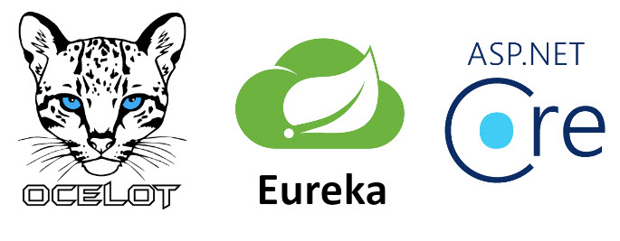
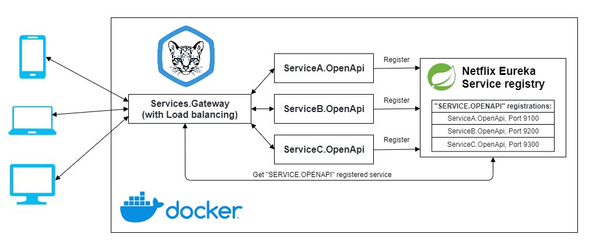
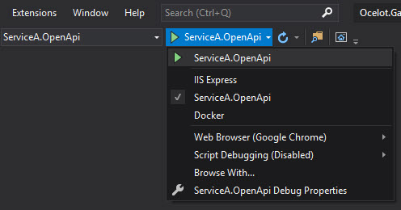
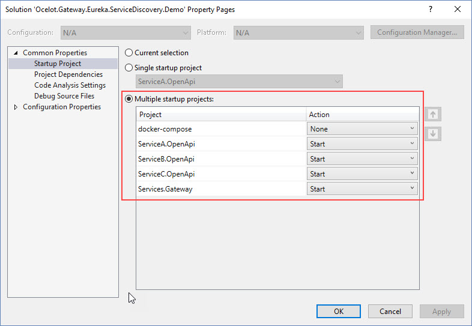
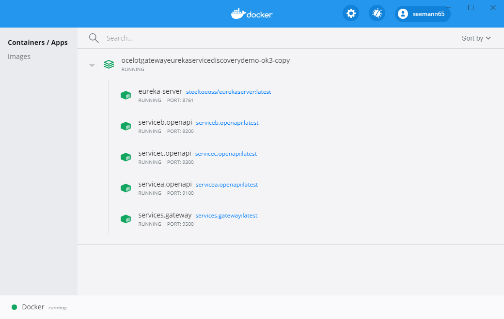
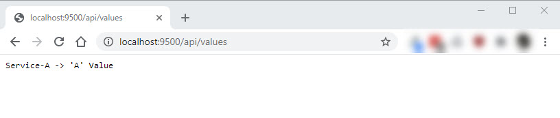
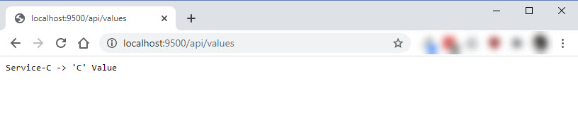
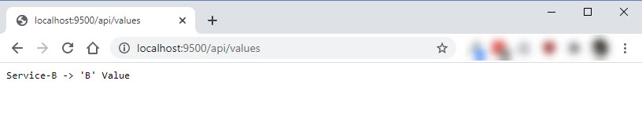

# Building API Gateway with load balancer and service discovery

In my [previous demo](https://github.com/matjazbravc/Microservice.Architecture.Demo) I showed how to implement microservice architecture using ASP.NET Core. This demo expands the microservice architecture with gateway load balancer ([Ocelot](https://github.com/ThreeMammals/Ocelot)) and service discovery ([Eureka](https://spring.io/projects/spring-cloud-netflix)).

## Load balancing
Load balancing improves the distribution of workloads across multiple computing resources. Load balancing aims to optimize resource use, maximize throughput, minimize response time, and avoid overload of any single resource. [Ocelot](https://github.com/ThreeMammals/Ocelot) can load balance across available downstream services for each Route. This means you can scale your downstream services and [Ocelot](https://github.com/ThreeMammals/Ocelot) can use them effectively. The type of load balancer available are:

* **LeastConnection** - tracks which services are dealing with requests and sends new requests to service with least existing requests. The algorythm state is not distributed across a cluster of Ocelot’s.

* **RoundRobin** - loops through available services and sends requests. The algorythm state is not distributed across a cluster of Ocelot’s.

* **NoLoadBalancer** - takes the first available service from config or service discovery.

* **CookieStickySessions** - uses a cookie to stick all requests to a specific server. More info below.

We will use **RoundRobin** load balancer. Why? **RoundRobin** load balancing is one of the simplest methods for distributing client requests across a group of servers. Going down the list of servers in the group, the **RoundRobin** load balancer forwards a client request to each server in turn. When it reaches the end of the list, the load balancer loops back and goes down the list again (sends the next request to the first listed server, the one after that to the second server, and so on).

## Service discovery
Service discovery is the automatic detection of services on a computer network. A service registry is useful because it enables client-side load-balancing and decouples service providers from consumers without the need for DNS.
Ocelot allows you to specify a service discovery provider and will use this to find the host and port for the downstream service [Ocelot](https://github.com/ThreeMammals/Ocelot) is forwarding a request to. This is only supported in the **GlobalConfiguration** section which means the same service discovery provider will be used for all Routes you specify a ServiceName for at Route level.
There are some types of service discovery we can use in [Ocelot](https://github.com/ThreeMammals/Ocelot), such as [Consul](https://www.consul.io/docs/intro), [Eureka](https://spring.io/projects/spring-cloud-netflix), and so on. In this demo we will use and set up a Netflix Eureka service registry.
Ocelot uses [Steeltoe](https://steeltoe.io/) to communicate with [Eureka](https://spring.io/projects/spring-cloud-netflix), which is an open source project that enables .NET developers to implement industry standard best practices when building resilient microservices.

## Configuration
The following configuration shows how to set up multiple downstream services for a **Routes** using **ocelot.json** and use the **RoundRobin** load balancer and **Eureka** service discovery.
```json
{
  "Routes": [
    {
      "ServiceName": "SERVICE.OPENAPI",
      "DownstreamPathTemplate": "/{everything}",
      "UpstreamPathTemplate": "/{everything}",
      "UpstreamHttpMethod": [ "GET" ],
      "FileCacheOptions": {
        "TtlSeconds": 15
      },
      "LoadBalancerOptions": {
        "Type": "RoundRobin"
      }
    }
  ],
  "GlobalConfiguration": {
    "RequestIdKey": "OcRequestId",
    "DownstreamScheme": "http",
    "ReRoutesCaseSensitive": false,
    "UseServiceDiscovery": true,
    "ServiceDiscoveryProvider": {
      "Host": "services.gateway",
      "Port": 8761,
      "Type": "Eureka"
    }
  }
}
```

## Architecture


#### Services:
* **Services.Gateway**: Gateway to all APIs
* **ServiceA.OpenApi**: Simple OpenAPI REST service
* **ServiceB.OpenApi**: Simple OpenAPI REST service
* **ServiceC.OpenApi**: Simple OpenAPI REST service

First, each service instance registers itself to the service discovery service by providing its name and address.

<u>**NOTE: ALL SERVICES HAVE THE SAME REGISTRY NAME "SERVICE.OPENAPI**"</u>

After this step client is able to get information about this service by querying the service discovery.

**ServiceA.OpenApi** appsettings.json file:
```json
{
  "Logging": {
    "LogLevel": {
      "Default": "Information",
      "Microsoft": "Warning",
      "Microsoft.Hosting.Lifetime": "Information"
    }
  },
  "Spring": {
    "Application": {
      "Name": "SERVICE.OPENAPI"
    }
  },
  "Eureka": {
    "Client": {
      "ServiceUrl": {
        "DefaultZone": "http://localhost:8761/eureka/"
      },
      "ValidateCertificates": false,
      "ShouldRegisterWithEureka": true
    },
    "Instance": {
      "NonSecurePort": 9100,
      "HostName": "localhost",
      "InstanceId": "ServiceA.OpenApi,Port:9100",
      "HealthCheckUrlPath": "/api/values/healthcheck",
      "StatusPageUrlPath": "/api/values/status"
    }
  },
  "AllowedHosts": "*"
}
```
**ServiceB.OpenApi** appsettings.json file:
```json
{
  "Logging": {
    "LogLevel": {
      "Default": "Information",
      "Microsoft": "Warning",
      "Microsoft.Hosting.Lifetime": "Information"
    }
  },
  "Spring": {
    "Application": {
      "Name": "SERVICE.OPENAPI"
    }
  },
  "Eureka": {
    "Client": {
      "ServiceUrl": {
        "DefaultZone": "http://localhost:8761/eureka/"
      },
      "ValidateCertificates": false,
      "ShouldRegisterWithEureka": true
    },
    "Instance": {
      "NonSecurePort": 9200,
      "HostName": "localhost",
      "InstanceId": "ServiceB.OpenApi,Port:9200",
      "HealthCheckUrlPath": "/api/values/healthcheck",
      "StatusPageUrlPath": "/api/values/status"
    }
  },
  "AllowedHosts": "*"
}
```
**ServiceC.OpenApi** appsettings.json file:
```json
{
  "$schema": "https://steeltoe.io/schema/latest/schema.json",
  "Logging": {
    "LogLevel": {
      "Default": "Information",
      "Microsoft": "Warning",
      "Microsoft.Hosting.Lifetime": "Information"
    }
  },
  "Spring": {
    "Application": {
      "Name": "SERVICE.OPENAPI"
    }
  },
  "Eureka": {
    "Client": {
      "ServiceUrl": {
        "DefaultZone": "http://localhost:8761/eureka/"
      },
      "ValidateCertificates": false,
      "ShouldRegisterWithEureka": true
    },
    "Instance": {
      "NonSecurePort": 9300,
      "HostName": "localhost",
      "InstanceId": "ServiceC.OpenApi,Port:9300",
      "healthCheckUrlPath": "/api/values/healthcheck",
      "statusPageUrlPath": "/api/values/status"
    }
  },
  "AllowedHosts": "*"
}
```
# Steps To Run the Solution locally
You can easily test and debug solution locally. You have to ...

1. Set all project in solution to start project launch settings like this


2. Select multiple startup projects:


3. Open command prompt and start Eureka server in Docker with  
**Docker run -p 8761:8761 steeltoeoss/eureka-server**

4. Run multiple projects from Visual studio

# Running in Docker

## Docker-Compose Files
**Docker-compose.yml** file with setup for all the containers looks like this:
```yml
version: '3.6'

services:
    eureka-server:
        container_name: eureka-server
        image: steeltoeoss/eurekaserver:latest
        restart: on-failure
        hostname: eureka-server
        networks:
            - backend_network

    servicea.openapi:
        container_name: servicea.openapi
        image: servicea.openapi:latest
        restart: on-failure
        hostname: servicea.openapi
        build:
            context: .
            dockerfile: src/ServiceA.OpenApi/Dockerfile
        networks:
            - backend_network

    serviceb.openapi:
        container_name: serviceb.openapi
        image: serviceb.openapi:latest
        restart: on-failure
        hostname: serviceb.openapi
        build:
            context: .
            dockerfile: src/ServiceB.OpenApi/Dockerfile
        networks:
            - backend_network

    servicec.openapi:
        container_name: servicec.openapi
        image: servicec.openapi:latest
        restart: on-failure
        hostname: servicec.openapi
        build:
            context: .
            dockerfile: src/ServiceC.OpenApi/Dockerfile
        networks:
            - backend_network

    services.gateway:
        container_name: services.gateway
        image: services.gateway:latest
        restart: on-failure
        hostname: services.gateway
        build:
            context: .
            dockerfile: src/Services.Gateway/Dockerfile
        networks:
            - backend_network

networks:
    backend_network:

```
and **Docker-compose.override.yml** file:
```yml
version: '3.6'

services:
    eureka-server:
        environment:
            - EUREKA_SERVER_ENABLE_SELF_PRESERVATION=false
        ports:
            - 8761:8761

    servicea.openapi:
        environment:
            - ASPNETCORE_ENVIRONMENT=Development
            - ASPNETCORE_URLS=http://+:80
            - EUREKA_CLIENT_SERVICEURL_DEFAULTZONE=http://eureka-server:8761/eureka
        ports:
            - 9100:80
        volumes:
            - ${APPDATA}/Microsoft/UserSecrets:/root/.microsoft/usersecrets:ro
            - ${APPDATA}/ASP.NET/Https:/root/.aspnet/https:ro
        depends_on:
            - eureka-server

    serviceb.openapi:
        environment:
            - ASPNETCORE_ENVIRONMENT=Development
            - ASPNETCORE_URLS=http://+:80
            - EUREKA_CLIENT_SERVICEURL_DEFAULTZONE=http://eureka-server:8761/eureka
        ports:
            - 9200:80
        volumes:
            - ${APPDATA}/Microsoft/UserSecrets:/root/.microsoft/usersecrets:ro
            - ${APPDATA}/ASP.NET/Https:/root/.aspnet/https:ro
        depends_on:
            - eureka-server

    servicec.openapi:
        environment:
            - ASPNETCORE_ENVIRONMENT=Development
            - ASPNETCORE_URLS=http://+:80
            - EUREKA_CLIENT_SERVICEURL_DEFAULTZONE=http://eureka-server:8761/eureka
        ports:
            - 9300:80
        volumes:
            - ${APPDATA}/Microsoft/UserSecrets:/root/.microsoft/usersecrets:ro
            - ${APPDATA}/ASP.NET/Https:/root/.aspnet/https:ro
        depends_on:
            - eureka-server

    services.gateway:
        environment:
            - ASPNETCORE_ENVIRONMENT=Development
            - ASPNETCORE_URLS=http://+:80
            - EUREKA_CLIENT_SERVICEURL_DEFAULTZONE=http://eureka-server:8761/eureka
        ports:
            - 9500:80
        volumes:
            - ${APPDATA}/Microsoft/UserSecrets:/root/.microsoft/usersecrets:ro
            - ${APPDATA}/ASP.NET/Https:/root/.aspnet/https:ro
        depends_on:
            - eureka-server
            - servicea.openapi
            - serviceb.openapi
            - servicec.openapi

```
# Setup the Containers
To execute compose file, open Powershell, and navigate to the compose file in the root folder. Then execute the following command: **docker-compose up -d**. The -d parameter executes the command detached. This means that the containers run in the background and don’t block your Powershell window. To check all running Containers use **docker ps**.



## Check it out
Let’s make a first call through API Gateway **http://localhost:9500/api/values**. As we can see, we got response from **Service-A**

With another request we got response from **Service-C**

And again, we make another request and we got response from **Service-B**

And so on...

## Conclusion
[Ocelot](https://github.com/ThreeMammals/Ocelot) successfuly comunicates with [Eureka](https://spring.io/projects/spring-cloud-netflix) service registry and retrives service registrations, load balancer loops through available services and sends requests. It works! Enjoy!

## Prerequisites
- [Visual Studio](https://www.visualstudio.com/vs/community) 2019 16.4.5 or greater
- [.NET Core SDK 3.1](https://dotnet.microsoft.com/download/dotnet-core/3.1)
- [Docker](https://www.docker.com/resources/what-container)  

## Tags & Technologies
- [ASP.NET Core 3.1](https://docs.microsoft.com/en-us/aspnet/?view=aspnetcore-3.1#pivot=core)
- [Ocelot](https://github.com/ThreeMammals/Ocelot)  
- [Eureka](https://spring.io/projects/spring-cloud-netflix)
- [Docker](https://www.docker.com/resources/what-container)  

## Licence
Licenced under [MIT](http://opensource.org/licenses/mit-license.php).
Contact me on [LinkedIn](https://si.linkedin.com/in/matjazbravc).
